# Documentation et modèle de données final

Ce document regroupe le graphe logique final et la documentation source du jeu de données.

## Partie I — Graphe du modèle final

### Vue logique

Diagramme logique reconstruit depuis `DATA_README.md` et vérifié avec la source de vérité `data/canonical.py`.

```mermaid
erDiagram
    COMPANY {
        string company_id PK
        string legal_name
        string headquarters_city
        int founded_year
        int headcount
        string ceo_employee_id FK
    }

    EMPLOYEE {
        string employee_id PK
        string full_name
        string role_title
        string org_unit
        string email
        date hire_date
        string manager_id FK "cache dans les sources"
        int title_rank "derive du poste"
        decimal monthly_gross_salary "canonique uniquement"
        boolean is_key_person
    }

    KEY_DEPENDENCY {
        string key_dependency_id PK
        string type
        string employee_id FK
        string customer_id FK
        string note
    }

    FINANCIAL_SUMMARY {
        string company_id FK
        string period
        decimal annual_revenue "derive des factures"
        decimal payroll_monthly
        decimal fleet_leasing_monthly
        decimal fuel_monthly
        decimal other_opex_monthly
        decimal gross_margin_pct
        int dso_days
        int dpo_days
        decimal cash_on_hand
    }

    CUSTOMER {
        string customer_id PK
        string name
        string industry
        string priority_tier
        string account_manager "rapprochement par nom"
        decimal strategic_value
        string city
    }

    SALES_ORDER {
        string order_id PK
        string customer_id FK
        string po_number UK
        date order_date
        datetime promised_delivery_deadline
        string status
    }

    INVOICE {
        string invoice_id PK
        string order_id FK
        decimal amount
        string currency
        string status
    }

    CONTRACT_SLA {
        string contract_id PK
        string customer_id FK
        time sla_deadline
        decimal late_penalty_per_hour
        string special_terms
    }

    PRODUCT {
        string sku PK
        string name
        string category
        decimal temperature_min
        decimal temperature_max
        decimal unit_value
    }

    SUPPLIER {
        string supplier_id PK
        string name
        string category
        int payment_term_days FK
    }

    PAYMENT_TERM {
        string name PK
        int days UK
    }

    SHIPMENT {
        string shipment_id PK
        string order_id FK
        string carrier_id FK
        string origin_warehouse FK
        string destination
        string status
        datetime estimated_arrival
        boolean temperature_controlled
        int battery_backup_hours
    }

    SHIPMENT_ITEM {
        string shipment_id PK, FK
        string sku PK, FK
        int quantity
    }

    CARRIER {
        string carrier_id PK
        string name UK
        string service_type
        decimal reliability_score
    }

    WAREHOUSE {
        string warehouse_id PK
        string name
        string city
    }

    INVENTORY {
        string warehouse_id PK, FK
        string sku PK, FK
        int available_units
        int reserved_units
    }

    VEHICLE {
        string license_plate PK
        string type
        int year
        boolean is_refrigerated
        string carrier_id FK
    }

    DRIVER {
        string driver_id PK
        string name "rapprochement employe par nom"
        string certifications
        string carrier_id FK
    }

    CUSTOMER_CLAIM {
        int id PK
        string customer_ref FK
        string shipment_ref FK "nullable"
        string type
        date opened_at
        date closed_at
        string status
    }

    SLA_PENALTY_LOG {
        int id PK
        string customer_ref FK
        string shipment_ref FK
        int hours_late
        decimal penalty_amount
        string month
    }

    LEGACY_CONTACT {
        int id PK
        string raw_name "resolution floue client"
        string email
        string phone
        string notes
    }

    BACKUP_CAPACITY {
        string route PK
        string backup_carrier "rapprochement par nom"
        int max_cold_chain_capacity
        decimal emergency_rate
    }

    EMAIL {
        string id PK
        string from_address
        string to_address
        string subject
        string body
        datetime received_at
        string labels
    }

    COMPANY ||--|{ EMPLOYEE : emploie
    EMPLOYEE o|--o{ EMPLOYEE : supervise
    COMPANY ||--|| FINANCIAL_SUMMARY : consolide
    EMPLOYEE ||--o{ CUSTOMER : gere
    EMPLOYEE ||--o{ KEY_DEPENDENCY : constitue
    CUSTOMER ||--o{ KEY_DEPENDENCY : concerne

    CUSTOMER ||--o{ SALES_ORDER : passe
    SALES_ORDER ||--o{ INVOICE : facture
    CUSTOMER ||--o{ CONTRACT_SLA : contractualise

    SALES_ORDER ||--o{ SHIPMENT : execute
    SHIPMENT ||--|{ SHIPMENT_ITEM : contient
    PRODUCT ||--o{ SHIPMENT_ITEM : reference
    CARRIER ||--o{ SHIPMENT : transporte
    WAREHOUSE ||--o{ SHIPMENT : origine

    WAREHOUSE ||--o{ INVENTORY : stocke
    PRODUCT ||--o{ INVENTORY : inventorie
    CARRIER ||--o{ VEHICLE : exploite
    CARRIER ||--o{ DRIVER : mandate
    EMPLOYEE o|--o| DRIVER : peut_etre
    CARRIER o|--o{ BACKUP_CAPACITY : propose
    EMPLOYEE o{--o{ EMAIL : participe
    CARRIER o{--o{ EMAIL : participe

    PAYMENT_TERM ||--o{ SUPPLIER : applique
    CUSTOMER ||--o{ CUSTOMER_CLAIM : ouvre
    SHIPMENT o|--o{ CUSTOMER_CLAIM : peut_concerner
    CUSTOMER ||--o{ SLA_PENALTY_LOG : subit
    SHIPMENT ||--o{ SLA_PENALTY_LOG : genere
    CUSTOMER o|--o{ LEGACY_CONTACT : rapprochement_flou
```



## Répartition physique

| Domaine | Source principale |
|---|---|
| Clients, commandes, factures, produits, fournisseurs, paiements | ERP Odoo mock |
| Expéditions, transporteurs, véhicules, chauffeurs, suivi et eCMR | TMS Dashdoc mock |
| Réclamations, pénalités historiques, contacts legacy | SQLite annexe |
| Inventaire, secours transporteur, annuaire, agrégats financiers | Excel |
| PO, facture, contrat SLA, bon de livraison | PDF |
| Indices hiérarchiques et échanges d'incident | Emails |
| Société, hiérarchie complète, rangs, salaires, dépendances clés | `canonical.py` uniquement |

## Conventions du graphe

- `PK`, `FK`, `UK` : clé primaire, étrangère et unique.
- Les relations « rapprochement » reposent sur les noms ou l'entity resolution, pas sur une FK exposée.
- Les PDF et l'eCMR sont des projections documentaires des entités métier, pas de nouvelles entités canoniques.
- `annual_revenue` et la concentration du CA sont calculés depuis les factures ; le décalage de trésorerie est dérivé de `dso_days - dpo_days`.
- `manager_id` représente la vérité cachée utilisée pour valider l'organigramme reconstruit ; il n'est publié dans aucune source opérationnelle.


---

## Partie II — Documentation source

# Briques 1 + 1bis — Data synthétique (scénario SH-2049)

Jeu de données synthétiques, **hétérogènes et répartis de façon réaliste**, pour une
démo d'*agentic ontology builder* dans le transport/logistique. Le fil rouge : le
retard de la livraison **SH-2049** (lot d'insuline cold-chain pour MedPharma). Couvre
l'opérationnel/commercial (Brique 1) **et** la couche RH + finances (Brique 1bis :
société, employés, organigramme caché, dépendances clés, agrégats financiers).

> Ces briques ne produisent QUE de la data + les sources qui l'exposent. **Aucune
> ontologie, aucun agent, aucune UI.** La source de vérité unique est
> [`data/canonical.py`](data/canonical.py) ; tout le reste en dérive.

---

## 1. Quelle entité vit dans quelle source ?

| Entité | Source | Pourquoi là |
|---|---|---|
| Clients, commandes de vente, **factures**, produits, fournisseurs, conditions de paiement | **ERP — Odoo mock** (`data/odoo/odoo_dump.json`) | Finance & commercial : c'est le rôle d'un ERP. |
| **Transports/expéditions**, eCMR, véhicules, chauffeurs, transporteurs, suivi/eta | **TMS — Dashdoc mock** (`data/dashdoc/dashdoc_dump.json`) | Tout l'opérationnel transport vit dans le TMS. **SH-2049 vit ici.** |
| Réclamations historiques, pénalités SLA passées, **export legacy de contacts** | **SQLite annexe** (`data/db/annex.db`) | Ce qu'une PME bricole vraiment en interne — PAS la base centrale. |
| Matrice transporteurs de secours, liste de priorité client, snapshot inventaire | **Excel** (`data/excel/*.xlsx`) | Fichiers bureautiques qui « traînent ». |
| PO, facture, contrat SLA, bon de livraison | **PDF** (`data/pdfs/*.pdf`) | Documents (texte extractible). |
| Messages du scénario (+ bruit anodin) | **Emails** (`data/emails/emails.json` + seed Outlook + mock MCP) | La conversation autour de l'incident. |
| **Employés** (Nom · Poste · Service · Email · Date d'entrée) | **Excel** (`data/excel/company_directory.xlsx`) | Un annuaire interne liste *qui* travaille là, **pas la hiérarchie**. |
| **Indices de hiérarchie** (signatures `Nom — Poste`, escalades/délégations) | **Emails** (`data/emails/emails.json`) | La hiérarchie transparaît dans les échanges, elle n'est écrite nulle part. |
| **Agrégats société** (masse salariale, flotte, marge, DSO/DPO, trésorerie) | **Excel** (`data/excel/finances_summary.xlsx`) | Le reporting de gestion que sort l'expert-comptable. |
| **CA total & concentration par client** | **Calculés** depuis les factures (`canonical.total_revenue()` / `revenue_concentration()`) | Dérivés des factures, jamais saisis en dur. |

> **Vivent UNIQUEMENT dans `canonical.py`, jamais exposés tels quels en source :**
> la société (`COMPANY`), **l'organigramme** (`EMPLOYEES[].manager_id`, vérité cachée),
> le `title_rank`, les salaires (`monthly_gross_salary`) et `KEY_DEPENDENCIES`.
> L'annuaire Excel n'a **aucune colonne Manager / N+1**, et aucun artefact sérialisé
> (xlsx, JSON) ne contient `manager_id`.

**Pourquoi cette répartition est réaliste.** Une PME de transport ne stocke pas tout
dans une base SQL maison. L'opérationnel transport vit dans un **TMS** (type Dashdoc),
la finance/commercial dans un **ERP** (type Odoo), et la petite **base interne** se
limite à ce qu'on bricole soi-même (réclamations, pénalités, vieux export de contacts).
Les fichiers Excel/PDF et les emails complètent ce paysage hétérogène. C'est ce
**recoupement (mêmes IDs métier, vocabulaires de champs différents)** qui force
l'entity resolution et prouve la valeur d'une ontologie.

---

## 2. Mapping des noms de champs ↔ canonique

Les **identifiants métier sont identiques** partout (MedPharma/C001, PO-8821, SH-2049,
INV-7742, PHARMA-22…). Seuls les **noms de champs** changent selon la source.

### ERP Odoo (`odoo_dump.json`)

| Canonique | Odoo-like | Table Odoo |
|---|---|---|
| `customer_id` | `partner_id` | `res.partner` |
| `name` | `name` | `res.partner` |
| `priority_tier` | `category` | `res.partner` |
| `account_manager` | `user_id` | `res.partner` |
| `strategic_value` | `x_strategic_value` | `res.partner` |
| `industry` | `industry_id` | `res.partner` |
| `order_id` | `order_id` | `sale.order` |
| `po_number` | `client_order_ref` | `sale.order` |
| `order_date` | `date_order` | `sale.order` |
| `status` (order) | `state` | `sale.order` |
| `invoice_id` | `move_id` | `account.move` |
| `po_number` (origine) | `invoice_origin` | `account.move` |
| `amount` | `amount_total` | `account.move` |
| `currency` | `currency_id` | `account.move` |
| `status` (invoice) | `payment_state` | `account.move` |
| `sku` | `product_id` | `product.product` |
| `temperature_min/max` | `x_temp_min` / `x_temp_max` | `product.product` |
| `unit_value` | `list_price` | `product.product` |

> Mapping de valeurs : statut facture `Pending` → `payment_state="not_paid"`,
> `Paid` → `"paid"`. Les fournisseurs sont des `res.partner` avec `supplier_rank>0`
> (clé `res.partner.suppliers`) ; conditions de paiement dans `account.payment.term`.

### TMS Dashdoc (`dashdoc_dump.json`)

| Canonique | Dashdoc-like |
|---|---|
| `shipment_id` | `transports[].uid` |
| `origin_warehouse` | `loading_address` (nom + ville de l'entrepôt) |
| `destination` | `unloading_address` |
| `carrier_id` → nom | `carrier.name` |
| `temperature_controlled` | `is_cold_chain` + `requested_vehicle` (frigo/standard) |
| `estimated_arrival` | `tracking.eta` |
| `temperature_min/max` (produit) | `temperature_setpoint.{min,max}` |
| `shipment_items` | `deliveries[].{sku, quantity}` |

### SQLite annexe (`annex.db`)

| Canonique | Colonne SQL |
|---|---|
| `customer_id` (référencé) | `customer_ref` |
| `shipment_id` (référencé, nullable) | `shipment_ref` |
| nom client « sale » | `legacy_contacts.raw_name` |

Tables : `customer_claims`, `sla_penalty_log`, `legacy_contacts` (trois, point final).

### Annuaire interne (`company_directory.xlsx`)

| Canonique (`EMPLOYEES[]`) | En-tête Excel |
|---|---|
| `employee_id` | `Matricule` |
| `full_name` | `Nom` |
| `role_title` | `Poste` |
| `org_unit` | `Service` |
| `email` | `Email` |
| `hire_date` | `Date d'entrée` |

> **Volontairement absents de l'annuaire** : `manager_id` (vérité cachée),
> `title_rank` (dérivable du `Poste`), `monthly_gross_salary` (un annuaire interne
> n'affiche pas les salaires). Un annuaire liste *qui travaille là*, pas *qui commande qui*.

### Reporting de gestion (`finances_summary.xlsx`)

Deux blocs : (1) agrégats société (`FINANCIAL_SUMMARY` + `total_revenue()` pour le CA),
(2) **concentration du CA par client**, calculée par `revenue_concentration()` (triée
décroissante). Aucune valeur de CA n'est saisie dans l'Excel : tout est dérivé des
factures. Le **décalage de trésorerie** (CashflowGap) émerge de `dso_days - dpo_days`
(clients payés plus tard que les fournisseurs) — non pré-calculé.

---

## 2bis. Reconstruction de l'organigramme (cœur de la démo RH)

**L'organigramme n'est dans AUCUNE source.** C'est réaliste : une PME n'a pas de fichier
`org_chart` propre et à jour. Le champ `manager_id` (« qui reporte à qui ») est une
**vérité cachée** dans `canonical.py` — il sert à *générer des indices cohérents* et à
*valider* la reconstruction plus tard, mais on ne le **livre** pas : on le **recompose**.

La hiérarchie se reconstitue par recoupement de **trois familles d'indices** :

- **(a) Hiérarchie des titres + service** : `role_title` implique un ordre clair —
  `Directeur Général` (1) > `Directeur/Directrice <Service>` (2) > `Responsable <…>` (3) >
  `Chargé <…>` / `Chauffeur` / `Comptable` (4) — combiné au `Service` (`org_unit`).
- **(b) Signatures & escalades d'emails** : chaque email interne se signe `Nom — Poste`
  (confirme le poste, donc le rang), et certains **matérialisent un lien hiérarchique**
  par le langage métier (« je transmets pour validation à… », « je remonte au DG… »,
  « peux-tu prendre la tournée ? ») — jamais le mot « manager ».
- **(c) Références croisées ops** (déjà dans la data) : les **account managers** sont
  rattachés à leurs clients (Odoo `user_id`), les **chauffeurs** à leurs tournées
  (Dashdoc) → ancre ces employés dans un service identifiable (Commercial / Exploitation).

**Règle structurelle à deux branches** (la data la respecte pour une reconstruction
fiable, « à tous les coups ») :

1. **Branche chef de service → DG** : dans chaque service (hors Direction), la personne
   du **rang le plus élevé** reporte **directement au Directeur Général**. C'est un
   rattachement *inter-service* (le n+1 n'est pas dans le même service) → déduit de la
   règle, et confirmé par une escalade email (ex. Jules Bernard → Philippe Caron).
2. **Branche intra-service** : tout autre employé reporte, **dans son propre service**, à
   la personne de `title_rank` immédiatement supérieur. Comme il n'y a qu'**un** manager
   par niveau (rangs 2 et 3), le candidat est **unique** → aucune ambiguïté.

La section #10 de `validate.py` implémente cette heuristique déterministe et exige qu'elle
retrouve **100 %** des liens `manager_id` (preuve que la data porte assez d'indices —
sans coder d'agent LLM).

---

## 3. Le scénario SH-2049 (ce que la démo doit révéler)

1. **SH-2049** transporte 1000 unités de **PHARMA-22** (insuline, cold-chain 2–8°C)
   pour **MedPharma** (client Platinum, le plus stratégique : `strategic_value`
   1 200 000, le max du jeu).
2. Le camion (transporteur **ColdRoad**) est tombé en panne près de Lyon : **retard
   de 6h**, deadline contractuelle **18:00** dépassée → arrivée estimée **minuit**,
   alors que la **batterie du groupe froid ne tient que 3h**.
3. La facture liée **INV-7742 = 186 000 €** est la **plus grosse facture en cours
   (Pending)** de tout le jeu. Le contrat **CT-001** prévoit **7 000 €/h** de pénalité
   (la plus lourde) et l'escalade obligatoire vers l'account manager (Sarah Martin).
4. Une **capacité de secours** existe (email ColdFast Express + matrice Excel :
   Paris→Lyon, 20 palettes, 2 400 €).
5. **Pourquoi SH-2049 est LE point chaud** : c'est le **seul** shipment à cumuler
   cold-chain + client Platinum + pénalité ≥ 7 000 €/h + deadline du jour. Une analyse
   honnête le fait remonter en tête **par les chiffres, pas par un trucage**. (SH-2052
   est aussi `Delayed` mais moins grave — il sert de comparaison, pas de concurrent.)

---

## 4. Incohérences INTENTIONNELLES (ne pas prendre pour des bugs)

- **Résolution floue MedPharma** : `legacy_contacts` contient des variantes
  orthographiques volontairement « sales » — `Med Pharma SARL` et `MEDPHARMA (old)` —
  distinctes de l'entrée canonique `MedPharma`. C'est un cas de test d'entity
  resolution floue, pas une erreur.
- Les `customer_claims` sont **toutes closes** et aucune n'est liée à SH-2049 : le
  scénario est « frais » (l'incident vient d'arriver), c'est voulu.
- Le bruit (≈ 3–4× le scénario) n'est **pas marqué** dans les sources réalistes. Le
  flag interne `_scenario` n'existe que dans `canonical.py` et est exposé séparément
  dans [`data/_scenario_manifest.json`](data/_scenario_manifest.json) (filet pour la
  démo), jamais injecté dans les dumps pour ne pas dénaturer leur format.
- **Organigramme volontairement absent des sources** : assumé. La hiérarchie ne vit que
  dans `canonical.py` (`manager_id`), à reconstruire par les agents (cf. §2bis).
- **Réutilisation des noms** (entity resolution naturelle) : les 6 account managers
  (`Sarah Martin`, `Jules Bernard`, `Clara Moreau`, `Paul Lefevre`, `Emma Dubois`,
  `Hugo Petit`) sont **les mêmes personnes** que des employés du service Commercial
  (même `full_name` au caractère près). **Sarah Martin** est l'**homme-clé** : elle gère
  seule MedPharma (le compte le plus stratégique) — `KEY_DEPENDENCIES[KD-001]`.
- **Lien Driver ↔ Employee** : les **3 premiers chauffeurs** de `DRIVERS`
  (`Thomas Girard`, `Mehdi Faure`, `David Olivier`) ont leur `name` **fixé** pour matcher
  un `EMPLOYEES.full_name` (futur `Driver is_a Employee`). La fixation se fait **après** la
  boucle Faker (`DRIVERS[i]["name"] = …`) pour ne pas décaler la séquence des autres noms.
  Les 11 autres chauffeurs restent des noms Faker non reliés (sous-traitance — tous les
  chauffeurs ne sont pas salariés).
- **CA ≠ valeur stratégique** : MedPharma a la `strategic_value` max mais n'est pas le
  premier au CA facturé (un seul gros encours INV-7742). C'est voulu : la saillance vient
  du risque stratégique, pas du volume facturé. MedPharma reste dans le **top du CA**.

---

## 5. Commandes

```bash
# 0. Environnement (Python 3.11+)
python -m venv .venv && source .venv/bin/activate
pip install -r requirements.txt

# 1. Générer TOUS les artefacts (idempotent)
python data/generate_all.py

# 2. Valider la cohérence (PASS/FAIL, code retour non-zéro si échec)
python data/validate.py

# 3. Lancer les serveurs MCP mock (lecture seule, stdio) — voir mcp_mocks/README.md
python mcp_mocks/dashdoc_server.py
python mcp_mocks/odoo_server.py
python mcp_mocks/email_server.py

# 4. Seeder les emails vers Outlook via MCP — dry-run (sans dépendance externe)
python data/emails/seed_outlook.py --dry-run
```

> Les sous-générateurs sont aussi lançables seuls (`python data/odoo/build_odoo.py`,
> `python data/db/build_db.py`, etc.). Aucune valeur métier n'est dupliquée hors
> `canonical.py`. Les dates « aujourd'hui/demain » sont calculées à l'exécution : la
> démo reste cohérente quel que soit le jour de lancement.

## 6. Arborescence produite

```
data/
  canonical.py              # SOURCE DE VÉRITÉ UNIQUE
  generate_all.py           # orchestrateur idempotent
  validate.py               # 10 familles de checks PASS/FAIL
  _scenario_manifest.json   # IDs du scénario (filet démo)
  odoo/odoo_dump.json        + build_odoo.py
  dashdoc/dashdoc_dump.json  + build_dashdoc.py
  emails/emails.json         + build_emails.py + seed_outlook.py
  db/annex.sql, annex.db     + build_db.py
  excel/*.xlsx               + generate_excel.py
  pdfs/*.pdf                 + generate_pdfs.py
mcp_mocks/                  # 3 serveurs MCP stdio (TMS / ERP / email) + README
requirements.txt
DATA_README.md
```
